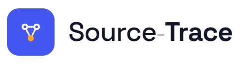
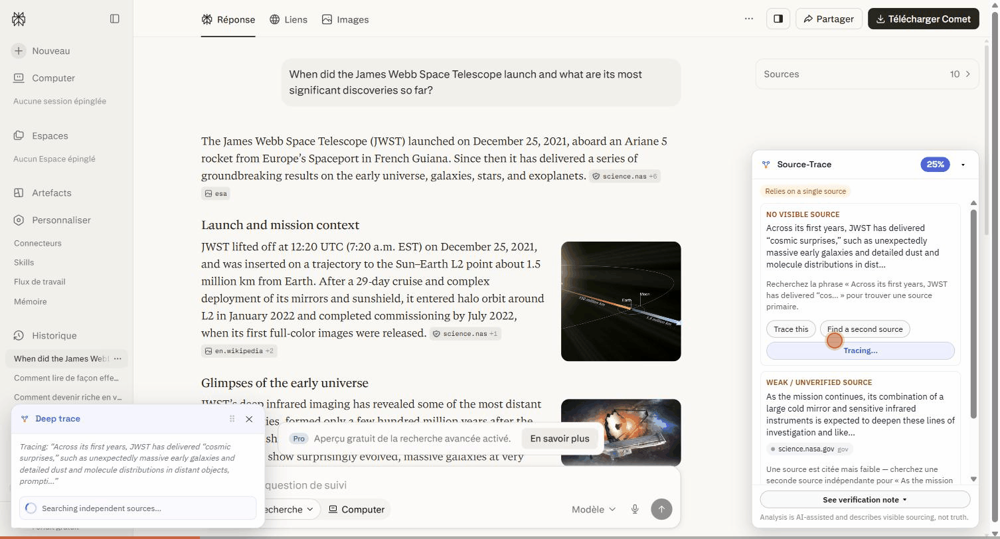

<div align="center">



# Source-Trace

**A browser extension + analysis backend that coaches you to trace the claims in an AI answer — instead of declaring them true or false.**

[](https://github.com/elielMengue/source-trace/actions/workflows/ci.yml)


<sub>Works on Perplexity + ChatGPT</sub>



<sub>▶ Also available as <a href="./docs/demo.mp4">MP4</a></sub>

</div>

---

## What it does

You ask an AI a question. It answers with confident prose and a few citation chips. **Which sentences are actually backed by a source, and which just sound authoritative?**

Source-Trace reads the answer in-page and paints a coaching overlay:

- 🟢 **Sourced** — a citation sits on this claim (open it and confirm it says what's claimed)
- 🟠 **Weak** — a source is cited but couldn't be verified, or it's the only one
- 🔴 **No visible source** — this sentence stands on nothing you can check

It never says *true* or *false*. It shows you **where the sourcing is thin and how to close the gap** — one click to reverse-search, find a second source, or run a **✨ Deep trace** that searches the web for independent sources and summarizes what each says (never a verdict).

## Product invariants (non-negotiable)

- **I1 — Coach, not oracle.** Every status describes *visible sourcing*, never *truth*. No feature — including Deep trace — is allowed to output a true/false verdict.
- **I2 — Transparent by construction.** AI use is disclosed in-product, and there's an on-device path: **Privacy mode** runs the heuristics locally and sends nothing to a backend.
- **I3 — Progressive, never blocking.** The overlay paints instantly from local heuristics and enriches as the backend returns; a slow or absent backend degrades gracefully instead of failing.

## Features

| | |
|---|---|
| **In-page overlay** | Per-claim sourcing status + trace score, injected via a Shadow-DOM UI that never touches the host page's styles. |
| **Inline highlighting** | Claims tinted in-place by status using the CSS Custom Highlight API (non-destructive Ranges). |
| **Deep trace** | Delegates the manual "open a tab and search" work to an LLM + web search; returns **independent sources with a neutral, attributed note each**, in a draggable, scrollable chat bubble. |
| **Verification note** | One-click, copy-paste-able summary of what's sourced and what to check — WYSIWYG (you copy exactly what you preview). |
| **Publisher hints** | Describes *who publishes* a source (news / encyclopedia / gov / …) — a category, never a trust score (I1). |
| **Privacy mode** | Heuristics-only, fully on-device; the network-bound features (full-mode extraction, Deep trace) are gated off. |
| **i18n** | Coaching tips localized (en / fr / es today), resolved by locale with an English fallback. |

## How it works

```
┌─────────────────────────────┐         ┌──────────────────────────────┐
│  Extension (MV3, WXT+React)  │         │        st-api (FastAPI)      │
│                              │  POST   │                              │
│  adapter → extract claims &  │ /v1/    │  heuristics + cache          │
│  citations from the DOM      │ analyze │  + LLM claim extraction      │
│         ↓                    │ ───────▶│  + SSRF-safe citation verify │
│  overlay + highlighting      │◀─────── │        ↓                     │
│         ↓                    │  Trace  │  Trace Report (JSON contract)│
│  "✨ Deep trace"  ───────────│ /v1/    │  web search via Gemini (demo)│
│  draggable sources bubble    │ trace   │  or Claude (prod), I1-safe   │
└─────────────────────────────┘         └──────────────────────────────┘
   Privacy mode: everything left of the line, nothing leaves the browser.
```

The Trace Report is a **contract-first JSON Schema** in `packages/shared`, from which both the TypeScript and Pydantic types are generated — so client and server can't drift.

## Monorepo layout

```
source-trace/
  apps/
    extension/   # WXT + React — adapters, overlay, popup, background orchestrator
    api/         # FastAPI — analyze, heuristics, citation verifier, deep trace, coach
  packages/
    shared/      # JSON Schema contract + generated TS/Pydantic types (Trace Report)
  infra/docker/  # api.Dockerfile (container recipe)
  railway.toml   # backend deploy config
```

## Quickstart — extension

```bash
pnpm install
pnpm build:ext      # production MV3 bundle → apps/extension/.output/chrome-mv3
```

Then load it in Chrome: **chrome://extensions → Developer mode → Load unpacked →** pick
`apps/extension/.output/chrome-mv3`, and open Perplexity or ChatGPT. The overlay appears
once an answer renders. (`pnpm dev:ext` launches a throwaway dev profile — handy for
iteration, but it isn't logged into the AI sites.)

`full` mode talks to `st-api` at `http://127.0.0.1:8000`. **Privacy mode** needs no backend
and never leaves the browser.

## Quickstart — API

```bash
cd apps/api
python -m venv .venv
# Windows PowerShell:  .venv\Scripts\Activate.ps1
# bash:                source .venv/bin/activate
pip install -e ".[dev]"
uvicorn source_trace_api.main:app --reload    # http://127.0.0.1:8000
```

Try it:

```bash
curl -X POST http://127.0.0.1:8000/v1/analyze \
  -H "Content-Type: application/json" \
  -d '{"answer":{"text":"The sky is blue. Studies show it is caused by Rayleigh scattering.","links":[]},"context":{"sourceSite":"chatgpt","locale":"en-US","clientVersion":"1.0.0"},"options":{"mode":"heuristics_only","maxClaims":20}}'
```

| Endpoint | Purpose |
|---|---|
| `GET /healthz` | Liveness + version. |
| `POST /v1/analyze` | Full Trace Report for an answer (heuristics + optional LLM extraction + citation verification). |
| `POST /v1/trace` | Deep trace one claim → independent sources with attributed notes (never a verdict). |

## Deploy the backend (Railway)

The API is a stateless container ([`infra/docker/api.Dockerfile`](./infra/docker/api.Dockerfile))
with a config-as-code [`railway.toml`](./railway.toml) that builds from that Dockerfile, binds
Railway's injected `$PORT`, and health-checks `/healthz`.

```bash
npm i -g @railway/cli
railway login
railway init            # create/link a project
railway up              # build the Dockerfile and deploy
```

Or connect the GitHub repo in the Railway dashboard for auto-deploy on push.

**Set secrets** in the Railway dashboard (or `railway variables --set …`) — never commit them:

| Variable | Why |
|---|---|
| `GEMINI_API_KEY` | Deep-trace provider for the demo (Google Search grounding). **No `ST_` prefix.** |
| `ST_LLM_API_KEY` | Full-mode claim extraction, and the **prod** deep-trace provider (Claude). |
| `ST_TRACE_PROVIDER` | `auto` (default) · `gemini` (demo) · `anthropic` (prod). |
| `ST_ALLOWED_EXTENSION_IDS` | Pin CORS to your published extension id(s) in production. |

See [`apps/api/.env.example`](./apps/api/.env.example) for the full list (all optional; sane
dev defaults apply). Without any LLM key, `full` mode degrades to heuristics-only and Deep
trace reports "unavailable" — the instant reverse-search links always remain (I3).

## Testing

```bash
cd apps/api && pytest        # backend (heuristics, verifier, deep trace, pipeline)
pnpm --filter @source-trace/extension test    # extension (extract, heuristics, highlight)
```

CI ([`.github/workflows/ci.yml`](./.github/workflows/ci.yml)) runs ruff + pytest for the API
and typecheck + vitest + MV3 build for the extension on every push and PR.

## Design & status

The full design — architecture, the Trace Report contract, ADRs (incl. zero-retention LLM
usage), and the per-feature checklist — lives in
[`Source-Trace_Technical_Design.md`](./Source-Trace_Technical_Design.md).

## Privacy & license

- **Privacy** — Privacy mode is fully on-device; Full mode sends the answer text to the
  backend (no content DB, content-free logs). Details, including third-party LLM
  processing for Deep trace, are in [`PRIVACY.md`](./PRIVACY.md).
- **License** — [MIT](./LICENSE).
