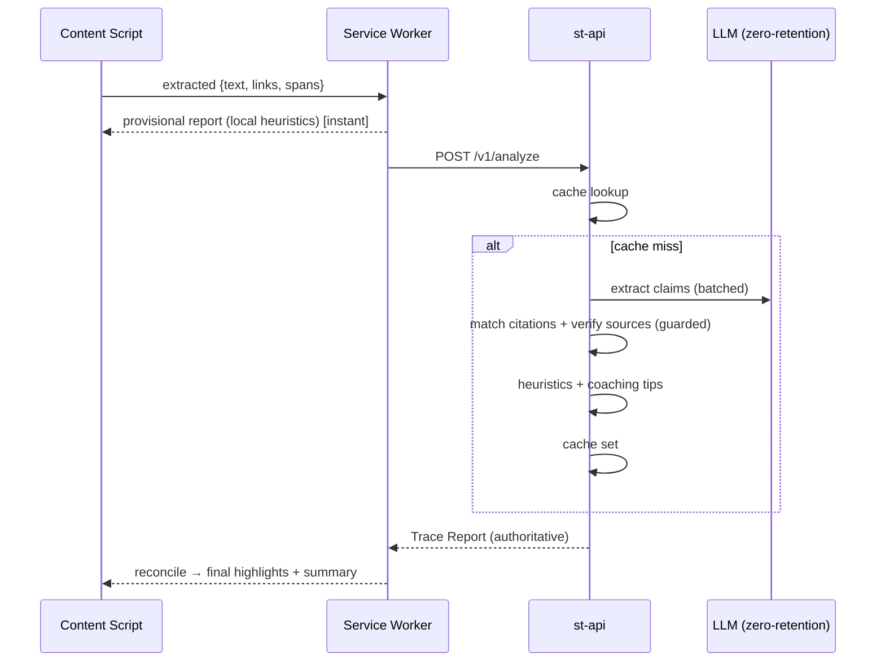

# Source-Trace — Technical Design Document

**Status:** Draft v1 · **Owner:** Engineering · **Audience:** builders
**Scope:** MVP architecture through v1 submission, designed to extend to production.

---

## 1. Direction (what we are building, and the invariants)

Source-Trace is a **browser extension + analysis backend** that reads an AI-generated answer, identifies which claims have visible, checkable sourcing, and **coaches the user to trace them** — rather than declaring anything true or false.

Three product invariants constrain every technical decision below. Treat them as non-negotiable:

- **I1 — Coach, not oracle.** The system never emits a truth verdict. A claim's `status` describes *whether it has adequate visible sourcing*, never *whether it is true*. This keeps us out of the "arbiter of truth" trap and is what makes the product defensible.
- **I2 — Transparent by construction.** We use AI to analyze AI. We disclose that in-product, and we offer a path that keeps content on-device. We practice the media literacy we teach.
- **I3 — Progressive, never blocking.** The UI paints something useful instantly and enriches it as deeper analysis returns. A slow or failed backend degrades gracefully; it never freezes the reading experience.

**Direction summary:** a TypeScript **Manifest V3** extension (WXT + React) talking to a stateless **FastAPI** service that combines fast local/remote heuristics with an **LLM-as-checker** pass, returning a single normalized artifact we call a **Trace Report**.

---

## 2. Goals / Non-goals

**Goals**
- Detect claims and citation support in AI answers on ≥2 platforms.
- Turn every unsupported claim into a one-click *tracing* action.
- Work across languages, not just English-dominant sources.
- Produce privacy-preserving usage evidence for the pilot.

**Non-goals (v1 — stated explicitly to protect scope)**
- Not a fact-checker. We do not assert truth.
- No user accounts, no server-side content storage, no dashboards.
- No mobile app, no multi-browser matrix, no ML models we train ourselves.

---

## 3. High-level architecture

```
┌──────────────────────────── Browser (Manifest V3) ────────────────────────────┐
│                                                                                │
│  Content Script (per-site adapter)        Overlay UI (React)   Popup (React)   │
│   • detect AI answer node                  • inline highlights   • session      │
│   • extract text + links + spans           • "trace this" CTA      summary      │
│         │                    ▲             • pre-share pause      • settings     │
│         ▼                    │                     ▲                  ▲          │
│  ┌───────────────────────────────────────────────────────────────────────┐    │
│  │  Background Service Worker  (orchestrator)                             │    │
│  │   • local heuristics (instant)   • cache lookup   • messaging bus      │    │
│  │   • calls st-api                 • session stats (local, anonymous)    │    │
│  └───────────────────────────────────────────────────────────────────────┘    │
└───────────────────────────────────────────────────────────────────────┬────────┘
                                                                          │ HTTPS
                                                                          ▼
┌──────────────────────────── st-api  (FastAPI, stateless) ─────────────────────┐
│   POST /v1/analyze                                                             │
│     1. Cache lookup (Redis, key = hash(text+locale))                          │
│     2. Claim extraction        ──►  LLM provider (zero-retention)             │
│     3. Citation matching (claims × links)                                      │
│     4. Source verification     ──►  Guarded Fetcher (SSRF-safe, HEAD)         │
│     5. Heuristics engine (density, single-source, dead-link, no-source)       │
│     6. Coaching-tip generator (locale-aware)                                   │
│     7. Assemble + cache + return  Trace Report                                 │
│                                                                                │
│   Cross-cutting: rate limiting · structured logging · metrics · no content DB │
└────────────────────────────────────────────────────────────────────────────────┘
```

**Why this split.** MV3 service workers are ephemeral and cannot run heavy or long-lived logic, and shipping model prompts inside the extension would leak them and complicate updates. Centralizing analysis in `st-api` gives us one place to evolve prompts, caching, and safety controls without re-shipping the extension through store review.

---

## 4. Component design

### 4.1 Content script + site adapters (`apps/extension/adapters`)
The most fragile surface — AI sites change their DOM often. We isolate that fragility behind an **adapter interface** so a broken selector never breaks the app, only one site.

```ts
interface SiteAdapter {
  id: 'chatgpt' | 'perplexity' | 'gemini' | 'claude';
  matches(url: string): boolean;
  findAnswerNodes(): HTMLElement[];
  extract(node: HTMLElement): {
    text: string;
    links: { url: string; anchorText: string }[];
    // char spans let the overlay highlight without re-parsing
    spans: { start: number; end: number }[];
  };
}
```

Resilience measures:
- **Versioned selectors fetched as remote *config*** (not code — MV3-compliant), so a selector fix is a config push, not a store release.
- **Graceful degradation:** if `findAnswerNodes()` returns nothing, the extension stays silent rather than erroring.
- **v1 adapters:** Perplexity (already cites → shows "supported" path) and ChatGPT (usually doesn't → shows "trace this" path). The contrast is deliberate and demos well.

### 4.2 Background service worker (orchestrator)
- Runs **instant local heuristics** (is there any link? citation density? claim-like sentence count) and paints a *provisional* Trace Report immediately (satisfies **I3**).
- Checks local cache, then calls `st-api` for the authoritative report and reconciles.
- Owns the **messaging bus** between content script, overlay, and popup (`chrome.runtime` messaging, typed).
- Maintains **anonymous session stats** in `chrome.storage.local` (counts only — see §9). No content persisted.

### 4.3 Overlay UI (React, injected)
- Renders inline highlights from `claims[].span`; unsupported claims get the **"trace this"** affordance.
- **Trace actions:** reverse text/image search, "find a second source," open cited link with a liveness badge.
- **Pre-share pause:** intercepts copy/share of low-`traceScore` content with a soft, dismissible prompt — never a hard block (**I1/I3**).
- Accessibility: keyboard-navigable, ARIA-labelled, respects reduced-motion and the host page's contrast.

### 4.4 Popup (React)
- Session summary ("2 of 5 claims had no visible source"), habit stats, language, and a **privacy mode toggle** (`full` ↔ `heuristics_only`).

### 4.5 Backend services (`apps/api`)
| Service | Responsibility | Notes |
|---|---|---|
| `analyze` (router) | Orchestrates the pipeline, assembles Trace Report | Stateless; idempotent per content hash |
| `claims` | LLM claim extraction | Batched: all claims in one call to cap cost |
| `citations` | Match claims ↔ provided links | Deterministic + LLM-assisted relevance |
| `verifier` | Check source liveness/relevance | Uses **Guarded Fetcher** (§8) |
| `heuristics` | density, single-source, dead-link, no-source flags | Pure functions, unit-tested, run even if LLM fails |
| `coach` | Generate locale-aware tracing tips | Template + LLM fallback; never English-only |
| `cache` | Redis get/set by `hash(text+locale+mode)` | TTL 7d; the main cost lever |

Failure policy: if the LLM pass fails or times out, the endpoint still returns a **heuristics-only** Trace Report with `engine.llm = null`. The product is always useful.

---

## 5. Core data flow



---

## 6. API contract

**`POST /v1/analyze`**

Request:
```jsonc
{
  "answer": {
    "text": "…full answer text…",
    "links": [{ "url": "https://…", "anchorText": "source 1" }]
  },
  "context": { "sourceSite": "chatgpt", "locale": "fr-FR", "clientVersion": "1.0.0" },
  "options": { "mode": "full", "maxClaims": 20 }   // mode: full | heuristics_only
}
```

Response — the **Trace Report** (single normalized artifact the whole client renders from):
```jsonc
{
  "traceReportId": "sha256:…",
  "traceScore": 0.42,               // share of claims with adequate VISIBLE support (not truth)
  "generatedAt": "2026-07-01T12:00:00Z",
  "engine": { "heuristics": "v1", "llm": "claude-…|null", "cached": false },
  "flags": ["no_visible_sources", "single_source"],
  "claims": [
    {
      "id": "c1",
      "text": "…",
      "status": "unsupported",       // supported | weak | unsupported  (about SOURCING, per I1)
      "matchedSourceIndexes": [],
      "reason": "No citation found for this statement.",
      "traceTip": "Reverse-search the phrase '…' to find a primary source.",
      "span": { "start": 120, "end": 180 }
    }
  ],
  "sources": [
    { "index": 0, "url": "https://…", "status": "live", "relevance": "high", "domain": "…" }
  ]
}
```

Contract discipline: the schema lives in **one place** (`packages/shared`, JSON Schema as source of truth) and TS types + Pydantic models are generated from it, so client and server can never silently drift.

---

## 7. Key design decisions (ADR-style)

**ADR-1 — LLM-as-checker with a privacy escape hatch.**
Robust claim extraction is an open problem; an LLM gets us there in-window. The tension: analysis needs the answer text, but we sell privacy. Resolution: `full` mode sends text to a **zero-retention** LLM endpoint (no training, no logging) and we persist nothing; `heuristics_only` mode never leaves the browser. Both are disclosed in-product (**I2**). Accepted trade-off: heuristics-only is less capable but fully private.

**ADR-2 — Progressive two-phase rendering.**
Local heuristics paint instantly; the authoritative report reconciles when it arrives. Guarantees a responsive feel regardless of network/LLM latency (**I3**). Cost: momentary state that may revise — mitigated by only ever *upgrading* confidence, never flip-flopping verdicts.

**ADR-3 — Status is about sourcing, not truth.**
`status ∈ {supported, weak, unsupported}` measures visible citation support only. This is the architectural encoding of **I1** and keeps us clear of defamation/authority risks and of the decolonial "trusted by whom?" trap.

**ADR-4 — Remote *config*, not remote *code*.**
Selectors and coaching templates are kept as **data** (the `AdapterSelectors` interface), so a fix is a config change, not a code rewrite — and the design is MV3-compliant (no remote code execution). *Status: selectors currently ship embedded in the build; the remote hot-swap fetch is roadmap. Demo mitigation for DOM drift: a recorded walkthrough + a local static HTML fixture that mimics an answer.*

**ADR-5 — Guarded fetch for source verification.**
Fetching arbitrary URLs from untrusted AI output is a live SSRF vector; it goes through a hardened fetcher (§8), never a naive `httpx.get`.

---

## 8. Security & privacy

- **SSRF-safe verifier:** allow only `http(s)`, resolve DNS and **block private/loopback/link-local ranges**, cap redirects (≤3), timeout (≤3s), `HEAD` first, size cap, no auth headers forwarded.
- **No content at rest:** answer text is processed transiently; only content **hashes** are cached (for dedupe), never plaintext. No content DB. *Cache is in-memory by default (dev); a Redis-backed `ReportCache` drops in behind the same Protocol for multi-worker prod.*
- **Zero-retention LLM:** provider configured for no-logging/no-training; documented in the privacy notice.
- **Abuse controls:** request size cap (`text` ≤ 100k via schema) and `maxClaims` bound are enforced today. *Per-client rate limiting (anonymous rotating token, Redis-backed) is **post-pilot** — not in the current build.*
- **Extension hardening:** minimal `host_permissions` (only the supported AI sites + the API origin), strict CSP, no `eval`, typed message passing to prevent injection between contexts.
- **CORS:** API pins to configured published extension id(s) (`ST_ALLOWED_EXTENSION_IDS`); with none set (dev) it accepts only well-formed unpacked-extension origins (`chrome-extension://[a-p]{32}`), never a blanket wildcard.

---

## 9. Observability & the pilot-evidence pipeline

Two separate concerns, both privacy-preserving:
- **Ops:** structured logs (no content), request metrics (latency p50/p95, cache hit rate, LLM error rate), error tracking. Enough to run it, nothing that identifies a user.
- **Evidence (for the submission):** the extension counts *events only* locally — `traces_initiated`, `shares_paused`, `sessions`, `claims_seen` — and can export an anonymous aggregate for the pilot report. This directly feeds Objective O2/O4 without collecting content or PII.

---

## 10. Non-functional requirements

| Dimension | Target (v1) |
|---|---|
| Provisional paint | < 150 ms after answer detected (local) |
| Authoritative report | p95 < 4 s (`full`), < 400 ms (cache hit) |
| Availability | Best-effort; graceful heuristics-only fallback on any backend failure |
| Cost | ≤ ~$X/1k analyses via caching + batched claims (validate in week 2) |
| i18n | Claim extraction + tips locale-aware; no English-only source assumptions |
| a11y | WCAG-AA overlay: keyboard, ARIA, reduced-motion |
| Privacy | No content persisted; heuristics-only mode fully on-device |

---

## 11. Tech stack

| Layer | Choice | Rationale |
|---|---|---|
| Extension | **WXT + React + TypeScript + Tailwind** | Vite DX, MV3 handled, HMR; matches your stack |
| Ext. state | **Zustand** + typed `chrome.runtime` messaging | Light, testable |
| Backend | **FastAPI + Pydantic + httpx (async)** | Your stack; async fits fan-out to LLM + verifier |
| Cache / limits | **Redis** | Content-hash cache + rate limiting |
| LLM | Anthropic/OpenAI async client, zero-retention | Swappable behind `claims`/`coach` interfaces |
| Shared types | JSON Schema → TS + Pydantic (`packages/shared`) | Single source of truth; no drift |
| Deploy | Docker → Fly.io/Render; Chrome Web Store | Simple, cheap |
| CI/CD | GitHub Actions (lint, test, build, package) | — |
| Observability | structlog + OpenTelemetry + Sentry | Content-free |

**Monorepo layout**
```
source-trace/
  apps/
    extension/     # WXT + React (adapters, overlay, popup, background)
    api/           # FastAPI (analyze, claims, citations, verifier, heuristics, coach)
  packages/
    shared/        # JSON Schema + generated TS/Pydantic types (Trace Report)
  infra/
    docker/  ci/
```

---

## 12. Feature list (tiered)

> Status markers: `[x]` done & verified · `[~]` partial (see note) · `[ ]` not started.
> Kept in sync as features land so progress stays legible as the project grows.

### Tier 0 — MVP (must ship for submission)
- [x] MV3 extension shell (WXT + React), Chrome/Edge
- [x] Site adapters: **Perplexity + ChatGPT** (config-driven selectors)
- [x] Content extraction: text + links + highlight spans
- [x] Instant local heuristics (provisional report)
- [x] `st-api /v1/analyze` (stateless) with cache
- [x] LLM claim extraction (batched) — *Anthropic extractor (structured outputs, one batched call); graceful fallback to deterministic*
- [x] Citation matching + **SSRF-safe** source verification — *LLM relevance + live `full`-mode network verify wired; deterministic fallback retained*
- [x] Heuristics: no-source / single-source / dead-link / density flags
- [x] Overlay: inline highlights + **"trace this"** actions — *coaching panel + trace actions + inline DOM highlighting (CSS Custom Highlight API, colored by sourcing status)*
- [x] **Pre-share pause** on low trace score
- [x] Session summary in popup
- [x] Locale-aware coaching tips (multilingual, incl. non-English sources)
- [x] Privacy mode toggle (`full` ↔ `heuristics_only`) + in-product disclosure
- [x] Anonymous local event counters (pilot evidence)

### Tier 1 — Should (if time allows before deadline)
- [x] Source reputation hints (transparent, non-authoritative; "who publishes this?") — *`publisher.ts`: publisher-type category, never a trust score (I1); on chips + note*
- [~] Reverse-image tracing for image sources — *deferred (post-MVP): needs a new image-extraction surface; current model is text-claims only; low demo value*
- [x] Confidence/quality indicator per source — *LLM `relevance` shown as signal bars on source chips (full mode)*
- [x] "Find a second source" helper — *overlay action on every non-supported claim*
- [x] Copyable verification note — *overlay footer: plain-text score + per-claim status + cited sources (I1)*

### Tier 2 — v2 / post-submission (roadmap, name to signal maturity)
- [ ] Additional adapters (Gemini, Claude, Bing)
- [ ] Firefox/Safari builds
- [ ] Optional accounts + cross-device habit tracking
- [ ] Educator mode / classroom aggregate view
- [ ] Trained lightweight on-device claim detector (reduce LLM dependence)

---

## 13. Risks & mitigations

| Risk | Impact | Mitigation |
|---|---|---|
| AI site DOM changes break adapters | High | Adapter isolation + remote selector config + silent degradation |
| LLM latency/cost | Medium | Cache by hash, batch claims, cap length, heuristics fallback |
| SSRF via cited URLs | High | Guarded fetcher (§8) |
| Perceived as "truth arbiter" | High (reputational) | I1 encoded in schema; coach-not-verdict UX |
| Privacy vs LLM contradiction | Medium | ADR-1: zero-retention + on-device mode + disclosure |
| Store review delay | Medium | Package + submit to Web Store early; pilot can side-load |

---

## 14. Immediate build sequence (maps to the 6-week roadmap)
1. `packages/shared`: define the Trace Report JSON Schema first (contract-first).
2. `apps/api`: FastAPI skeleton + heuristics + cache; `/v1/analyze` returning heuristics-only.
3. `apps/extension`: WXT shell + Perplexity adapter + provisional render against the API.
4. Add LLM claim extraction + citation verification; wire ChatGPT adapter.
5. Overlay coaching UX + pre-share pause + i18n; ship privacy toggle.
6. Instrument anonymous counters → run pilot → export evidence.
